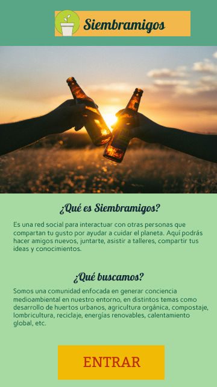
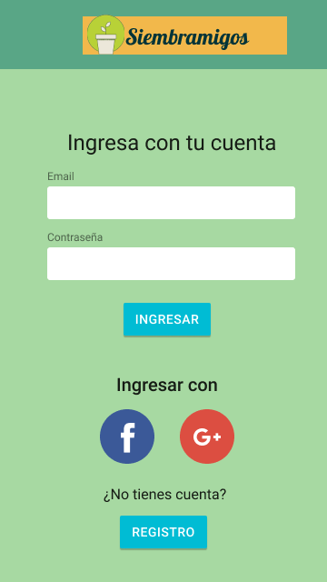
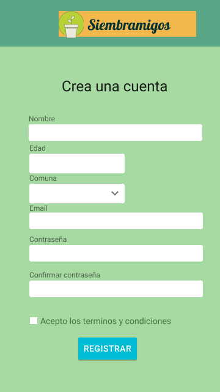
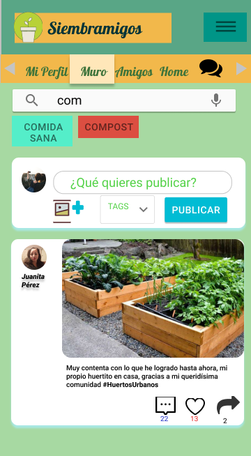
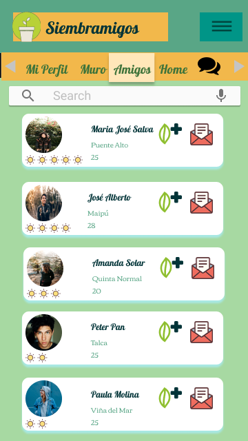
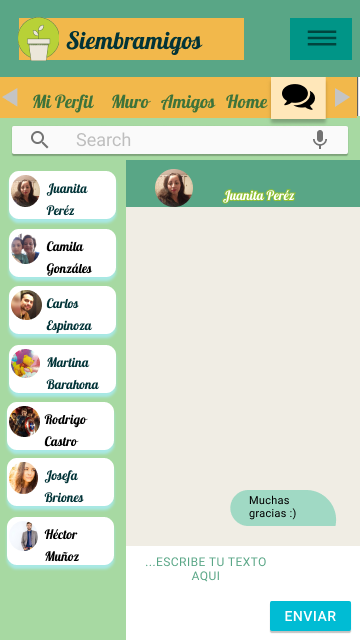

# Siembramigos

## Definición del producto

Nuestra aplicación es una red social enfocada en el cuidado del medio ambiente, y está basada en la creciente necesidad que se ha generado en la sociedad para cuidar el planeta.

El objetivo principal de esta aplicación es que aquellas personas que tengan interés en temas medioambientales puedan conocer a más gente que comparta sus mismos intereses, y se puedan generar instancias para compartir información, y así se puedan reunir y realizar actividades para generar conciencia en su entorno, ya sea que estén recién iniciandose en este tema, como también puede que tengan profesiones afines y que quieran aportar hacia la sociedad con su conocimiento en distintos temas como desarrollo de huertos urbanos, agricultura orgánica, compostaje, lombricultura, reciclaje, energías renovables, calentamiento global, etc.

## UX Design

### Definición de usuario
Para tomar las decisiones de diseño y funcionalidad de la aplicación nos basamos en un público objetivo, específicamente en personas residentes de la zona urbana de la ciudad, mayores de edad, y que en su mayoría tiene dificultades al momento de querer llevar a cabo sus actividades de reciclaje, ya sea por falta de espacio, o porque no tienen el conocimiento suficiente para aplicar ciertas técnicas para gestionar sus residuos de manera eficiente (ver carpeta ux design con documentación de respaldo). 

Basado en lo anterior, la aplicación tiene una sección donde el usuario puede conocer a más personas, interactuar y compartir conocimiento con respecto a los temas que le interesen, además de generar redes donde puedan juntarse, hacer talleres y generar conciencia en la sociedad, y así generar un impacto positivo sobre el entorno en el que viven.

### Prototipo de baja fidelidad

Para diseñar el prototipo de baja fidelidad de utilizó el programa Balsamiq Mockup y tiene las siguientes secciones:

Landing page: página de bienvenida que cuenta de qué se trata la aplicación y su objetivo.

Sección Log In, donde el usuario podrá ingresar con correo electrónico, o iniciar sesión directamente con Facebook o Google.

Sección registro, formulario donde el usuario ingresará sus datos para crear cuenta.

Ingreso al muro del usuario, sección donde aparecerán las publicaciones de los amigos del usuario.

### Prototipo de alta fidelidad

Para diseñar el prototipo de alta fidelidad de utilizó el programa Figma y consta de las siguientes secciones:

Landing Page

Sección Log In

Sección de registro

Ingreso al muro del usuario

Sección amigos del usuario

Sección chat

